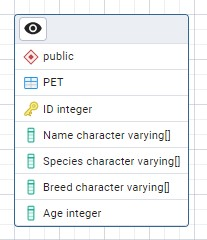
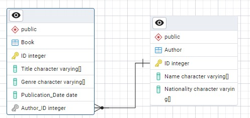
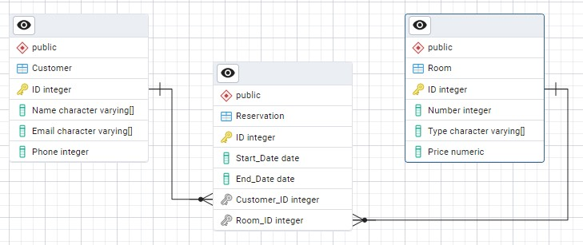

# Puntos de la Tarea

  **Punto 1: Modelo ER Básico - Pet Store (sin relaciones)**
   - **Descripción**: Crear un modelo entidad-relación para una tienda de mascotas que gestione información sobre las mascotas.
   - **Entidades**:
     - **Pet**: `Pet_ID`, `Name`, `Species`, `Breed`, `Age`

   - **Solución**:

      

  **Punto 2: Modelo ER Básico - Library**
   - **Descripción**: Crear un modelo entidad-relación para una biblioteca que gestione información sobre libros y autores.
   - **Entidades**:
     - **Book**: `Book_ID`, `Title`, `Genre`, `Publication_Date`
     - **Author**: `Author_ID`, `Name`, `Nationality`
   - **Relación**: Un autor puede escribir uno o más libros, y cada libro tiene un único autor.

  - **Solución**:

      

  **Punto 3: Modelo ER Complejo - Hotel Reservation System**
   - **Descripción**: Crear un modelo entidad-relación para un sistema de reservas de hotel que gestione información sobre clientes, habitaciones y reservas.
   - **Entidades**:
     - **Customer**: `Customer_ID`, `Name`, `Email`, `Phone`
     - **Room**: `Room_ID`, `Number`, `Type`, `Price`
     - **Reservation**: `Reservation_ID`, `Start_Date`, `End_Date`, `Customer_ID`, `Room_ID`
   - **Relaciones**:
     - Un cliente puede tener una o más reservas, pero una reserva pertenece a un único cliente.
     - Una habitación puede ser reservada múltiples veces, pero cada reserva está asociada a una única habitación.

  - **Solución**:
  
      
