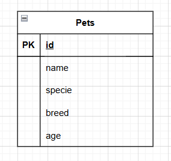

# HOMEWORK MODULO 6 CLASS-1

## Diagrama 1:
- **Descripción**:
Este modelo gestiona la información básica de las mascotas en la tienda.

**Entidad**: Pet

- `Pet_ID`: Identificador único de la mascota (PK).

- `Name`: Nombre de la mascota.

- `Species`: Especie de la mascota (ej. perro, gato).

- `Breed`: Raza de la mascota.

- `Age`: Edad de la mascota.

**Relaciones**: En este punto inicial, no hay relaciones.

