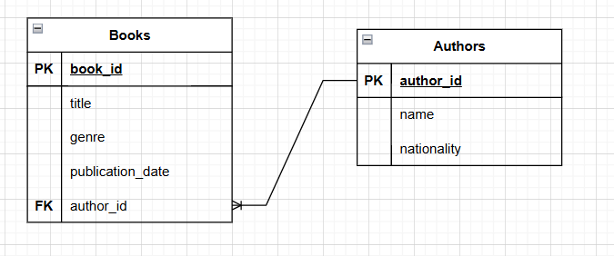

# HOMEWORK MODULO 6 CLASS-1

## Diagrama 2:
- **Descripción**:
Este modelo gestiona la información de los libros y sus autores en la biblioteca..

**Entidades**: 

Book

- `Book_ID`: Identificador único del libro (PK).

- `Title`: Título del libro.

- `Genre`: Género literario.

- `Publication_Date`: Fecha de publicación.

- `Author_ID`: Identificador único del autor (FK).

Author
- `Author_ID`: Identificador único del autor (PK).

- `Name`: Nombre del autor.

- `Nationality`: Nacionalidad del autor.

Un autor puede escribir uno o más libros, cada libro tiene un único autor, por lo que la FK es Author_ID.

