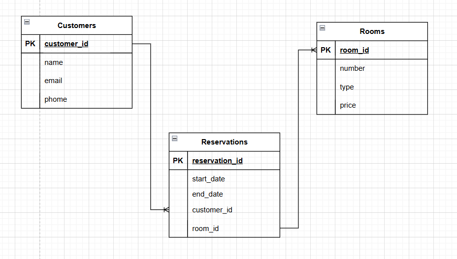

# HOMEWORK MODULO 6 CLASS-1

## Diagrama 3:
- **Descripción**:
Este modelo gestiona las reservas de habitaciones, clientes y la disponibilidad en un hotel.

**Entidades**: 

Customers

- `Customer_ID`: Identificador único del cliente (PK).

- `Name`: Nombre del cliente.

- `Email`: Correo electrónico.

- `Phone`: Número de teléfono.

Rooms

- `Room_ID`: Identificador único de la habitación (PK).

- `Number`: Número de habitación.

- `Type`: Tipo de habitación (ej. suite, estándar).

- `Price`: Precio por noche.

Reservations

- `Reservation_ID`: Identificador único de la reserva (PK).

- `Start_Date`: Fecha de inicio de la reserva.

- `End_Date`: Fecha de fin de la reserva.

- `Customer_ID`: Identificador del cliente (FK).

- `Room_ID`: Identificador de la habitación (FK).

**Relaciones:**

- Un cliente puede hacer múltiples reservas, pero cada reserva pertenece a un único cliente.

- Una habitación puede ser reservada varias veces, pero cada reserva está asociada a una única habitación.

