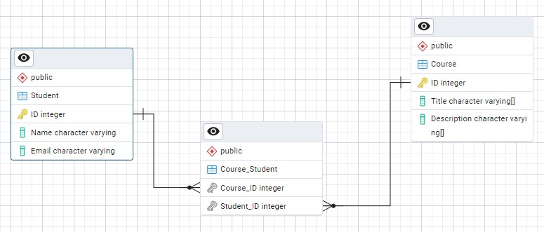
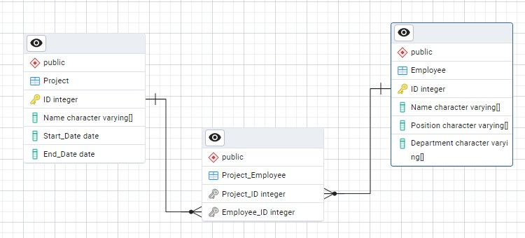
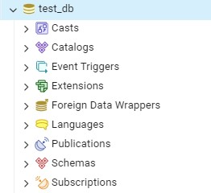

## Puntos de la Tarea

**Punto 1: Modelo ER Básico - Courses and Students**
   - **Descripción**: Crear un modelo entidad-relación para gestionar información sobre cursos y estudiantes con una relación muchos a muchos.
   - **Entidades**:
     - **Course**: `Course_ID`, `Title`, `Description`
     - **Student**: `Student_ID`, `Name`, `Email`
     - **Course_Student**: `Course_ID`, `Student_ID` (entidad de relación)
   - **Relaciones**:
     - Un estudiante puede estar inscrito en uno o más cursos.
     - Un curso puede tener uno o más estudiantes.

   - **Solución**:

      
    

**Punto 2: Modelo ER Complejo - Projects and Employees**
   - **Descripción**: Crear un modelo entidad-relación para gestionar información sobre proyectos y empleados con una relación muchos a muchos.
   - **Entidades**:
     - **Project**: `Project_ID`, `Name`, `Start_Date`, `End_Date`
     - **Employee**: `Employee_ID`, `Name`, `Position`, `Department`
     - **Project_Employee**: `Project_ID`, `Employee_ID` (entidad de relación / tabla pivote)
   - **Relaciones**:
     - Un empleado puede trabajar en uno o más proyectos.
     - Un proyecto puede tener uno o más empleados.

   - **Solución**:

      

**Punto 3: Instalación de PostgreSQL y PGAdmin**
   - **Descripción**: Instalar PostgreSQL y PGAdmin en sus computadoras.
   - **Instrucciones**:
     1. Descargar e instalar PostgreSQL desde [postgresql.org](https://www.postgresql.org/download/).
     2. Descargar e instalar PGAdmin desde [pgadmin.org](https://www.pgadmin.org/download/).
     3. Crear una base de datos de prueba en PGAdmin llamada `test_db`.
    
   - **Solución**:

      

