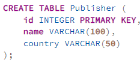
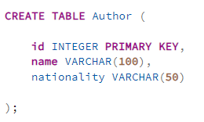
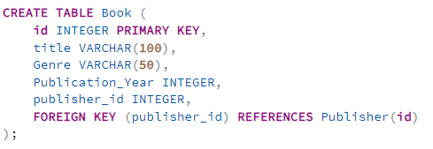
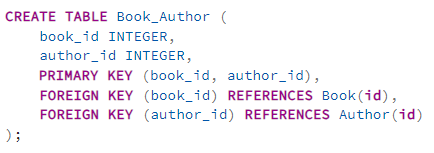
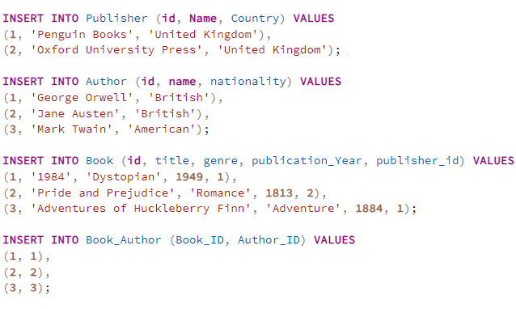

**Punto 1: Crear Tablas**
   - Generar las sentencias SQL para crear las tablas `Author`, `Book`, `Publisher` y `Book_Author`, incluyendo la definición de llaves primarias y foráneas.

   Solución:

**Punto 2: Insertar Datos**
   - Insertar datos de ejemplo en las tablas creadas utilizando sentencias `INSERT INTO`. Los datos de ejemplo se proporcionan a continuación.

   Solución:

   