**Punto 1: Generar Reportes con SELECT**
   - Reporte 1: Seleccionar todos los libros publicados por 'Penguin Books'.

      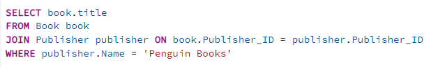 
      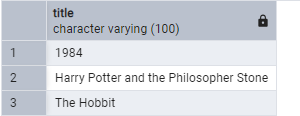

   - Reporte 2: Seleccionar todos los libros publicados después del año 1950.

      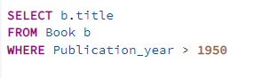
      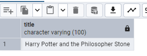
   
   - Reporte 3: Seleccionar los nombres de los autores que han escrito libros de género 'Fantasy' utilizando una subconsulta.

      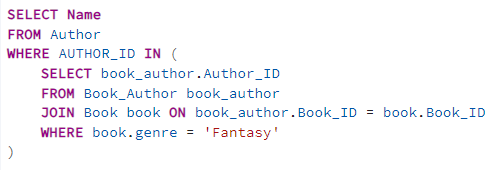
      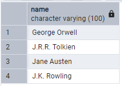

   - Reporte 4: Seleccionar los títulos de los libros escritos por autores cuyo nombre contiene 'J.K.' utilizando una subconsulta.

      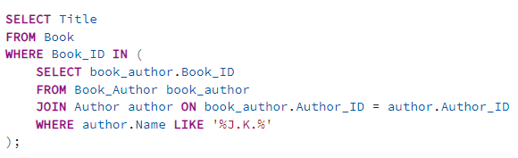
      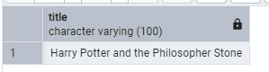

   - (Opcional) Reporte 5: Utilizando una subconsulta, seleccionar los títulos de los libros escritos por autores británicos.

      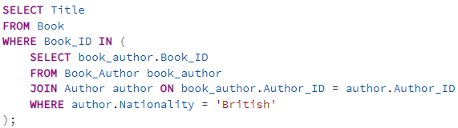
      

**Punto 2: Modificar Información con UPDATE**

   - Actualizar el género del libro '1984' a 'Science Fiction'.

      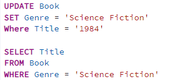
      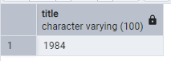

   - Cambiar la nacionalidad de 'Mark Twain' a 'Canadian'.

      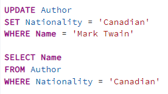
      

**Punto 3: Eliminar Información con DELETE**

   - Eliminar el libro 'Pride and Prejudice' de la base de datos.

      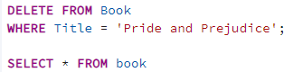
      

   - Eliminar los autores que no han escrito ningún libro. 

      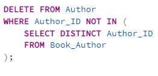

   