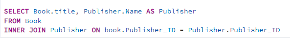
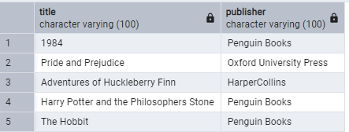
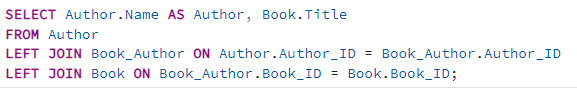
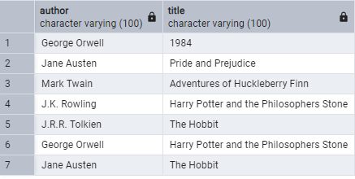
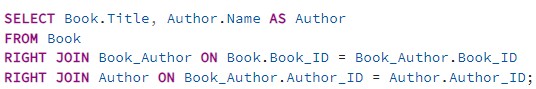
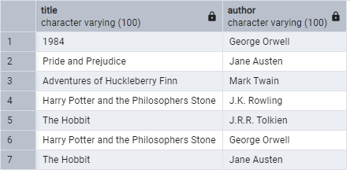
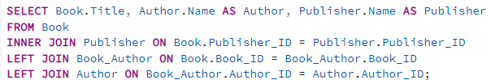
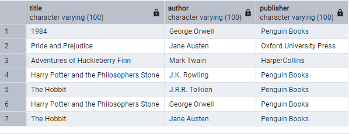
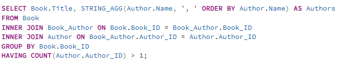
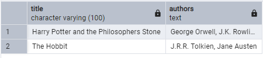

**Punto 1: Generar Reportes con JOINs**
   - Reporte 1: Usar INNER JOIN para seleccionar los títulos de los libros junto con el nombre de su editorial.

      
      

   - Reporte 2: Usar LEFT JOIN para seleccionar todos los autores y los títulos de los libros que han escrito, incluyendo autores que no han escrito ningún libro.

      
      
   
   - Reporte 3: Usar RIGHT JOIN para seleccionar todos los libros y los nombres de los autores que los han escrito, incluyendo libros que no tienen autores asociados.

      
      

   - Reporte 4: Usar una combinación de INNER JOIN y LEFT JOIN para seleccionar todos los libros, sus autores, y la editorial, incluyendo libros que no tienen autores y aquellos sin editorial.

      
      

   - Reporte 5: Usar INNER JOIN para seleccionar todos los libros que han sido escritos por más de un autor y mostrar el título del libro junto con los nombres de los autores.

      
      
   

