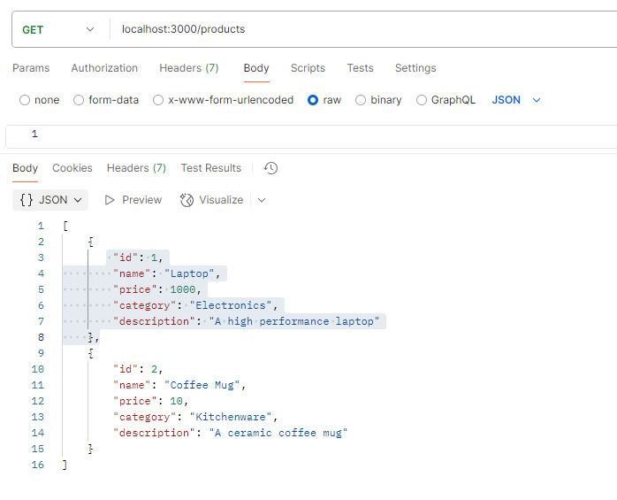
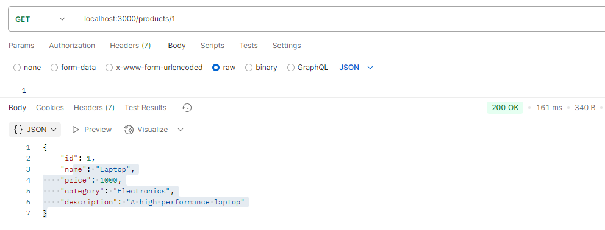
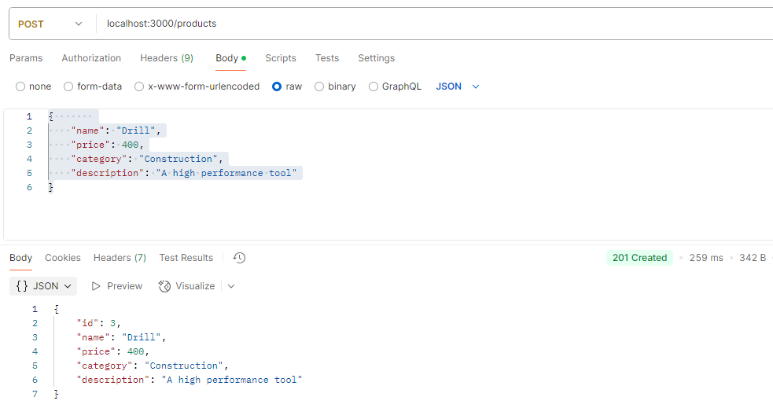
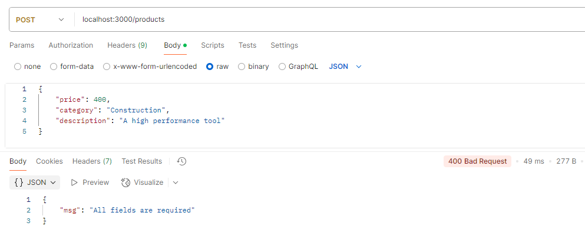
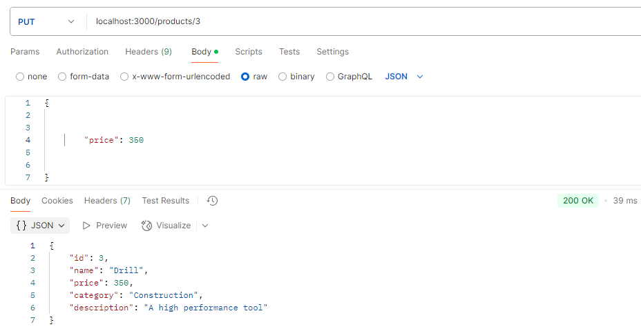
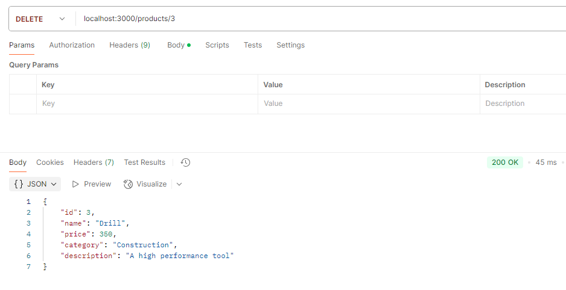

# API Gestión de productos

## Descripción

1. La url para consumir la API es 'localhost:3000'

2. La API tiene cinco endpoint `GET /products`, `GET /products/:id`, `POST /products`, `PUT /products`, y  `DELETE /products/:id`.

## Uso de la aplicación

#### GET
-Para consultar todos los productos se debe acceder al endpoint `GET /products`:

-Para consultar un producto en particular se debe acceder al endpoint `GET /products/:id`, donde id es el identificador del producto que se desea consultar:

Esta consulta tiene la validación para mostrar al usuario si el producto a consultar no existe:

#### POST
-Para crear un producto nuevo se debe acceder al endpoint `POST /products` y enviar en la pestaña Body la información con la siguiente estructura:

{    
    "name": "Nombre del producto",
    "price": Precio del producto,
    "category": "Categoría del producto",
    "description": "Descripción del producto.
}

Este endpoint contiene la validación para la integridad de los datos:
- Valida que se envíen todos los campos:

#### PUT
-Para actualizar la información de algún producto se debe acceder al endpoint `POST /products:id`, donde id es el identificador del producto que se desea actualizar, se debe enviar en la pestaña Body la información a actualizar:  `name`, `price`, `category`, `description`; teniendo en cuenta que puede enviar solo los atributos a actualizar:

#### DELETE
-Para eliminar algún producto se debe acceder al endpoint `DELETE /products:id`, donde el id corresponde al identificador del producto que se desea eliminar:

## Observaciones

1. Si se intenta consumir un endpoint inexistente el APi responderá not Found:

