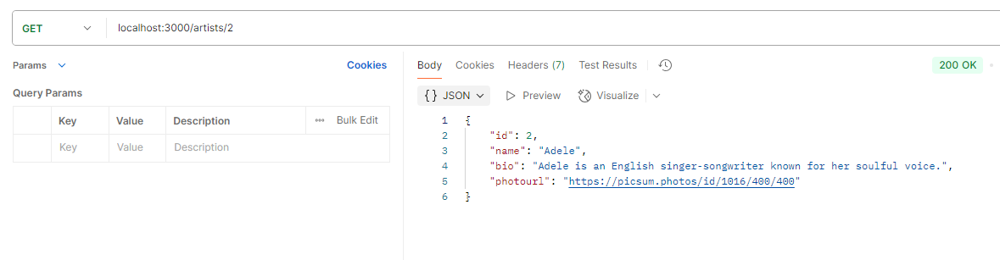
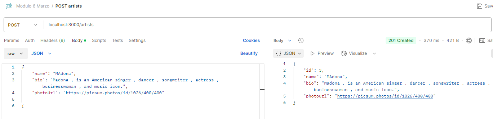

# API Gestión de artistas

## Descripción

1. La url para consumir la API es 'localhost:3000'

2. La API tiene cinco endpoint `GET /artists`, `GET /artists/:id`, `POST /artists`, `PUT /artists`, y  `DELETE /artists/:id`.

## Uso de la aplicación

#### GET
-Para consultar todos los artista se debe acceder al endpoint `GET /artists`:

-Para consultar un producto en particular se debe acceder al endpoint `GET /artists/:id`, donde id es el identificador del producto que se desea consultar:

#### POST
-Para crear un producto nuevo se debe acceder al endpoint `POST /artists` y enviar en la pestaña Body la información con la siguiente estructura:

{       
    "name": "Nombre del artista",
    "bio": "Descripción biográfica del artista",
    "photoUrl": "Url del artista"    
}

#### PUT
-Para actualizar la información de algún producto se debe acceder al endpoint `POST /artists:id`, donde id es el identificador del producto que se desea actualizar, se debe enviar en la pestaña Body la información a actualizar:  `name`, `bio`, `photoUrl`; teniendo en cuenta que puede enviar solo los atributos a actualizar:

#### DELETE
-Para eliminar algún producto se debe acceder al endpoint `DELETE /artists:id`, donde el id corresponde al identificador del producto que se desea eliminar:

## Observaciones

1. Si se intenta consumir un endpoint inexistente el APi responderá not Found:

